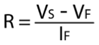
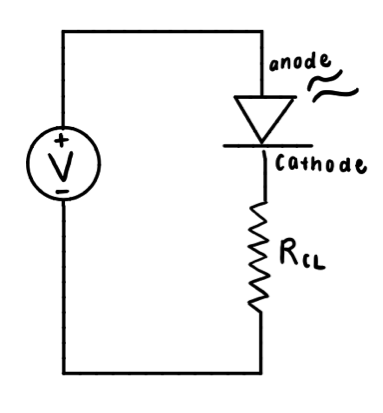
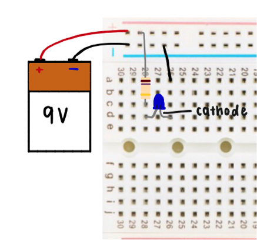

## Measuring Resistance

The Circuits lecture focused on the basics of circuit components which can be a lot to understand all at once.

Prof. Wood mentioned in lecture that students had used both a diode and resistor in a basic circuit “without knowing it”.

A super easy demo would be for students to rebuild that circuit now knowing what each element does and calculate the resistor value themselves.

Time 10 min

### Materials
-	Mini Solderless Breadboard
-	9V battery (in case)
-	White LED (could also use different colors)
-	Resistor

### Procedure
1.	Calculate the resistor value you need using the forward voltage of the LED as mentioned in lecture:

2.	Build the circuit following this circuit diagram using the resistor:

