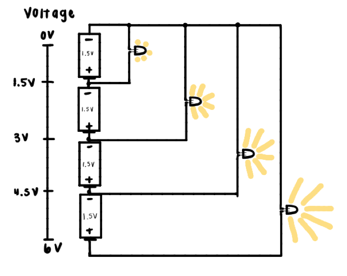
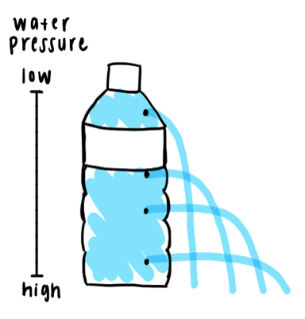

## Water Analogy

Build a circuit to help understand how voltage works and the overarching water analogy.

Time 15 min

### Materials
-	Mini Solderless Breadboard
-	4 x 1.5V Batteries
-	4 x LED (any color but all 4 have to be the same)
-	4 x Resistors
-	Wires
-	Water bottle
-	Tray
-	Something to make holes in the bottle (skewer, pencil, etc.)

### Procedure
1.	Build this circuit to observe how voltage applied changes the current through, and therefore the intensity, of the LED due to ohm's law (V=IR). Adding current limiting resistors with different values for each of the LEDs could get them all to the same brightness.

2.	This could also be a demo done by someone in a video that goes along with the project but the idea is to put a water bottle in a tray and poke 4 evenly spaced holes in it to show how the trajectory of the water changes based on how much pressure is on it (analogous to voltage in the circuit from step 1)

